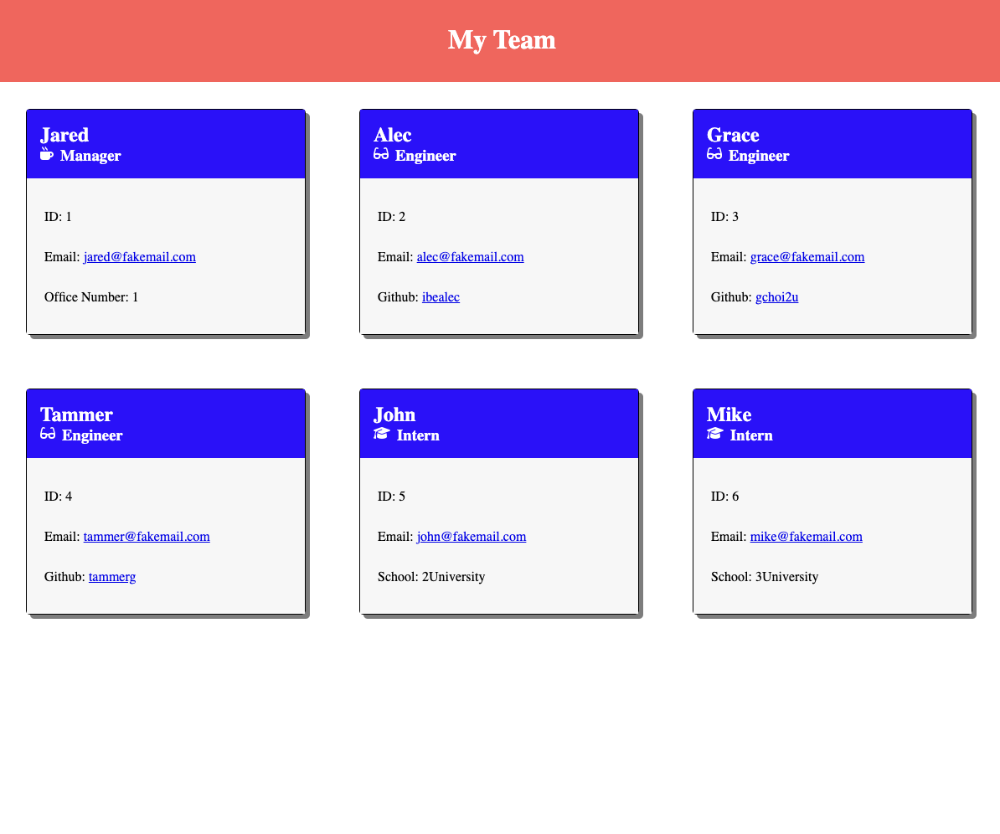

# Team Profile Generator

<p>
    
    
    
    
    
    
    
</p>


## Table of Contents
1. [Description](#description)
2. [User Story](#user-story)
3. [Screenshot](#screenshot)
4. [Demo](#demo)
5. [Installation](#installation)
6. [License](#license)
7. [Contributing](#contributing)
8. [Test](#test)
9. [Questions](#contact-information)

## Description
This is a Node.js command-line application that takes in information about employees on a software engineering team, then generates an HTML webpage that displays summaries for each person.


## User Story
```md
AS A manager
I WANT to generate a webpage that displays my team's basic info
SO THAT I have quick access to their emails and GitHub profiles
```

## Screenshot


## Demo
https://drive.google.com/file/d/1n8eXFUSPgwkdQI8qcQO9D8GjD_7hvXzZ/view?usp=sharing

## Installation
To clone the repo:
```
git clone https://github.com/shelldan/team-profile-generator.git
``` 
Run 'npm install' to install dependencies

Run 'node team.js' to run program

Open the 'team.html' file from the output folder in a web browser to view

---

## License
[](https://opensource.org/licenses/MIT) 

## Contributing 
To contribute to this application, create a pull request.
Here are the steps needed for doing that:
- Fork the repo
- Create a feature branch (git checkout -b NAME-HERE)
- Commit your new feature (git commit -m 'Add some feature')
- Push your branch (git push)
- Create a new Pull Request

Following a code review, your feature will be merged.

---

## Test:
There are also unit tests to help you build the classes necessary.

It is recommended that you follow this workflow:

1. Run tests
2. Create or update classes to pass a single test case
3. Repeat

🎗 Remember, you can run the tests at any time with:


    npm run test

---

## Contact Information
* GitHub Username: [shelldan](https://github.com/shelldan)


